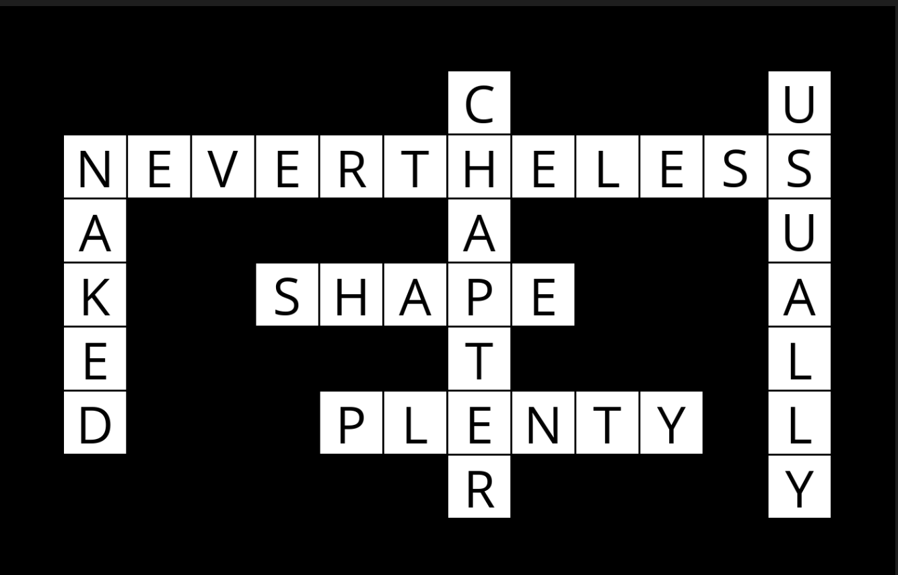

## **week0 - Search**

## [degrees](https://cs50.harvard.edu/ai/2020/projects/0/degrees/)

### _Background_

According to the Six Degrees of Kevin Bacon game, anyone in the Hollywood film industry can be connected to Kevin Bacon within six steps, where each step consists of finding a film that two actors both starred in.

In this problem, we’re interested in finding the shortest path between any two actors by choosing a sequence of movies that connects them. For example, the shortest path between Jennifer Lawrence and Tom Hanks is 2: Jennifer Lawrence is connected to Kevin Bacon by both starring in “X-Men: First Class,” and Kevin Bacon is connected to Tom Hanks by both starring in “Apollo 13.”

We can frame this as a search problem: our states are people. Our actions are movies, which take us from one actor to another (it’s true that a movie could take us to multiple different actors, but that’s okay for this problem). Our initial state and goal state are defined by the two people we’re trying to connect. By using breadth-first search, we can find the shortest path from one actor to another.

### _About_

The distribution code contains two sets of CSV data files:

- It uses BFS or DFS.
- one set in the large directory
- one set in the small directory.
  Each contains files with the same names, and the same structure, but small is a much smaller dataset for ease of testing and experimentation.

### _How to start_

Go into the directory _"degrees"_

```
$ cd week0/degrees/
```

If you want to run the **small** dataset

```
$ python3 degrees.py small
```

If you want to run the **large** dataset

```
$ python3 degrees.py large
```

Now enter two different actor names to find the degree of separation.

Open up `small/people.csv` or `large/people.csv` to see which actors are available for your curent set.

### _Result_

```
Loading data...
Data loaded.
Name: Doris Day
Name: Federico Fellini
Searching...
Explored Steps: 1801
3 degrees of separation.
1: Doris Day and Clint Eastwood starred in Don't Pave Main Street: Carmel's Heritage
2: Clint Eastwood and Bernardo Bertolucci starred in Kurosawa's Way
3: Bernardo Bertolucci and Federico Fellini starred in Bellissimo: Immagini del cinema italiano
```

## [tictactoe](https://cs50.harvard.edu/ai/2020/projects/0/tictactoe/)

### _About_

Using Minimax, implement an AI to play Tic-Tac-Toe optimally.

### _Getting Started_

Once in the directory for the project, run `pip3 install -r requirements.txt` to install the required Python package (`pygame`) for this project.

### _How to start:_

Go into the directory _"degrees"_

```
$ cd week0/degrees/
```

To run the game run:

```
$ python3 runner.py
```

### _Game_

| Menu                                     | Ingame                                   |
| ---------------------------------------- | ---------------------------------------- |
|  |  |

- You can choose to play as **`X`** (first move) or as **`O`** (second move).
- You play by clicking on one of the squares.

## **week1 - Knowledge**

## [knights](https://cs50.harvard.edu/ai/2020/projects/1/knights/)

### _Background_

In a Knights and Knaves puzzle, the following information is given: Each character is either a knight or a knave. A knight will always tell the truth: if knight states a sentence, then that sentence is true. Conversely, a knave will always lie: if a knave states a sentence, then that sentence is false.

The objective of the puzzle is, given a set of sentences spoken by each of the characters, determine, for each character, whether that character is a knight or a knave.

For example, consider a simple puzzle with just a single character named A. A says “I am both a knight and a knave.”

Logically, we might reason that if A were a knight, then that sentence would have to be true. But we know that the sentence cannot possibly be true, because A cannot be both a knight and a knave – we know that each character is either a knight or a knave, but not both. So, we could conclude, A must be a knave.

### _How to start:_

Go into the directory _"knights"_

```
$ cd week1/knights/
```

To run the game:

```
$ python3 puzzle.py
```

### _Result_

```
Puzzle 0
    A is a Knave
Puzzle 1
    A is a Knave
    B is a Knight
Puzzle 2
    A is a Knave
    B is a Knight
Puzzle 3
    A is a Knight
    B is a Knave
    C is a Knight
```

## [minesweeper](https://cs50.harvard.edu/ai/2020/projects/1/minesweeper/)

### _Background_

Minesweeper is a puzzle game that consists of a grid of cells, where some of the cells contain hidden “mines.” Clicking on a cell that contains a mine detonates the mine, and causes the user to lose the game. Clicking on a “safe” cell (i.e., a cell that does not contain a mine) reveals a number that indicates how many neighboring cells – where a neighbor is a cell that is one square to the left, right, up, down, or diagonal from the given cell – contain a mine.

### _Getting Started_

Once in the directory for the project, run `pip3 install -r requirements.txt` to install the required Python package (`pygame`) for this project.

### _How to start:_

Go into the directory _"minesweeper"_

```
$ cd week1/minesweeper/
```

How to run the game:

```
$ python3 runner.py
```

### _Game_

| Menu                                       | Ingame                                     |
| ------------------------------------------ | ------------------------------------------ |
|  |  |

- `AI Solo` is a game mode where the AI is playing on it's own.
- `AI Move` is one single move played by the AI.
- `Reset` will will reset the game board.
- You can also play on your won and get help by the AI by using `AI Move`.

## **week2 - Uncertainty**

## [heredity](https://cs50.harvard.edu/ai/2020/projects/2/heredity/)

### _Background_

Mutations in the GJB2 gene can cause hearing impairment in newborns. People carry two versions of this gene and can have 0, 1, or 2 copies of the mutated version, which is not always obvious without genetic testing. The number of mutated copies is a hidden state that can affect hearing impairment, but not everyone with mutated copies will exhibit the impairment.

Children inherit one copy of the GJB2 gene from each parent. If a parent has two copies of the mutated gene, the child will have it too. If the parent has no copies, the child won't have it. If the parent has one copy, the child has a 50% chance of inheriting it. The gene can also mutate further and change the likelihood of hearing impairment.

Each family member has a Gene variable (0, 1, or 2 copies) and a Trait variable (yes or no for hearing impairment). Genes affect the probability of having a particular trait, and the child's genes depend on the genes of their parents.

### _How to start:_

Go into the directory _"heredity"_

```
$ cd week2/heredity/
```

How to run it:

_Smallest dataset_

```
$ python3 heredity.py data/family0.csv
```

_Medium dataset_

```
$ python3 heredity.py data/family1.csv
```

_Biggest dataset_

```
$ python3 heredity.py data/family2.csv
```

### _Result_

```
Arthur:
  Gene:
    2: 0.0147
    1: 0.0344
    0: 0.9509
  Trait:
    True: 0.0000
    False: 1.0000
Hermione:
  Gene:
    2: 0.0608
    1: 0.1203
    0: 0.8189
  Trait:
    True: 0.0000
    False: 1.0000
Molly:
  Gene:
    2: 0.0404
    1: 0.0744
    0: 0.8852
  Trait:
    True: 0.0768
    False: 0.9232
```

- Gene represents the probability of how likely it is two have how many genes.
- Trait shows the probabilty of having the disease.

## [pagerank](https://cs50.harvard.edu/ai/2020/projects/2/pagerank/)

### _Background_

In PageRank’s algorithm, a website is more important if it is linked to by other important websites, and links from less important websites have their links weighted less. This definition seems a bit circular, but it turns out that there are multiple strategies for calculating these rankings.

**Different ways to achieve the page rank**

- Random Surfer Model
  - One way to think about PageRank is with the random surfer model, which considers the behavior of a hypothetical surfer on the internet who clicks on links at random.
- Iterative Algorithm
  - We can also define a page’s PageRank using a recursive mathematical expression.

### _How to start:_

Go into the directory _"pagerank"_

```
$ cd week2/pagerank/
```

How to run it:

_Smallest dataset_

```
$ python3 pagerank.py corpus0
```

_Medium dataset_

```
$ python3 pagerank.py corpus1
```

_Biggest dataset_

```
$ python3 pagerank.py corpus2
```

### _Result_

```
PageRank Results from Sampling (n = 10000)
  ai.html: 0.2006
  algorithms.html: 0.1070
  c.html: 0.1155
  inference.html: 0.1388
  logic.html: 0.0282
  programming.html: 0.2173
  python.html: 0.1197
  recursion.html: 0.0729
PageRank Results from Iteration
  ai.html: 0.1747
  algorithms.html: 0.0978
  c.html: 0.1108
  inference.html: 0.1197
  logic.html: 0.0257
  programming.html: 0.2066
  python.html: 0.1108
  recursion.html: 0.0673
```

- The numbers beding the pages are the **transition probabilities**. They represent how likely it is that the page will be visited.

## **week3 - Optimization**

## [crossword](https://cs50.harvard.edu/ai/2020/projects/3/crossword/)

### _Background_

How might you go about generating a crossword puzzle?

Given the structure of a crossword puzzle (i.e., which squares of the grid are meant to be filled in with a letter), and a list of words to use, the problem becomes one of choosing which words should go in each vertical or horizontal sequence of squares.

We can model this sort of problem as a constraint satisfaction problem. Each sequence of squares is one variable, for which we need to decide on its value (which word in the domain of possible words will fill in that sequence).

### _How to start:_

Go into the directory _"crossword"_

```
$ cd week2/crossword/
```

How to run it:

_Smallest crossword_

```
$ python3 generate.py data/structure0.txt data/words0.txt output0.png
```

_Medium crossword_

```
$ python3 generate.py data/structure1.txt data/words1.txt output1.png
```

_Biggest crossword_

```
$ python3 generate.py data/structure2.txt data/words2.txt output2.png
```

- You can mix up the structure text file and the word text file like `data/structure1.txt data/words2.txt`

* `output.png` creates a png with the solution.
  - Can also be removed from the command if the terminal log is enough.

### Result logs

```
██████████████
███████C████U█
█NEVERTHELESS█
█A█████A████U█
█K██SHAPE███A█
█E█████T████L█
█D███PLENTY█L█
███████R████Y█
██████████████
```

### Result PNG


